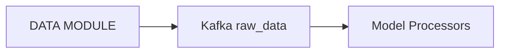
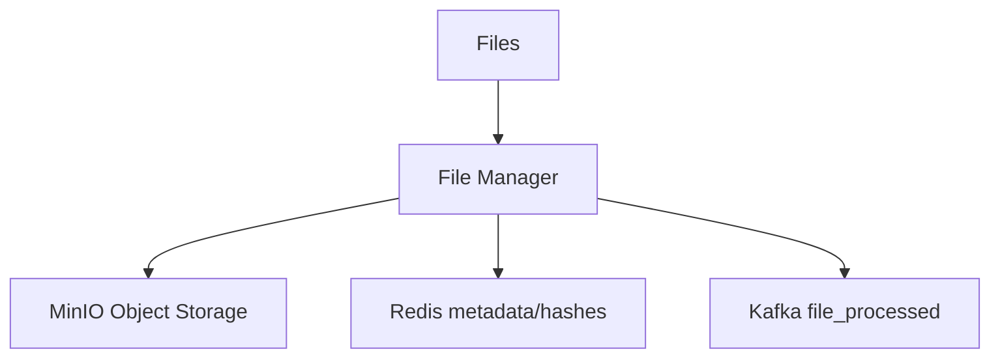
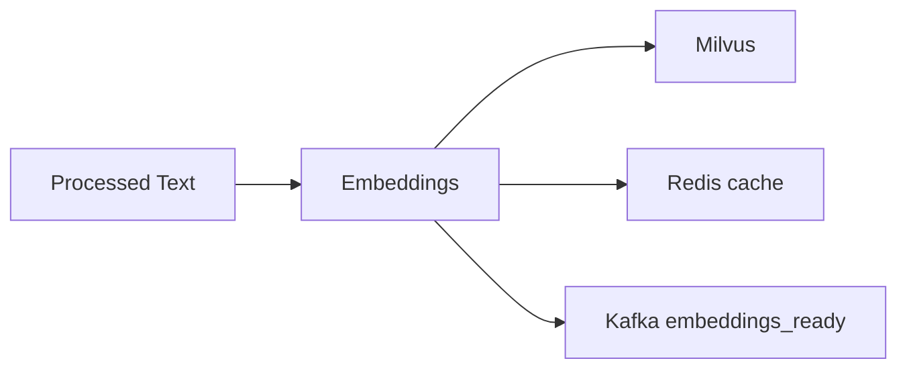
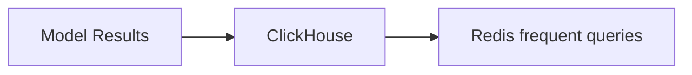
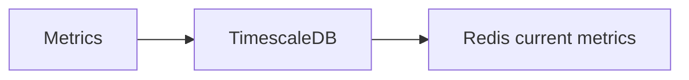
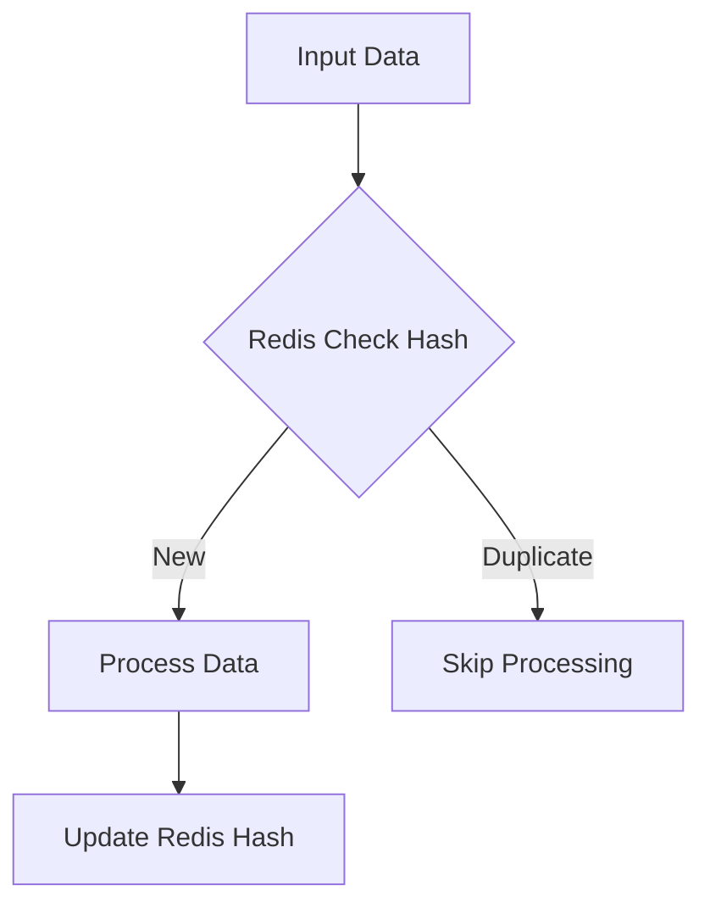

# استراتژی جریان داده در Smart Whale

## 🎯 مقدمه
این سند استراتژی بهینه جریان داده بین سرویس‌های مختلف در پروژه Smart Whale را توضیح می‌دهد. هدف اصلی، حداقل‌سازی پردازش و رسیدن به بهترین کارایی است.

## 🔄 معماری کلی سیستم‌ها

سیستم از اجزای زیر تشکیل شده است:
- **Kafka**: برای مدیریت جریان داده
- **Redis**: برای کش و lookup سریع
- **ClickHouse**: برای ذخیره داده‌های پردازش شده
- **TimescaleDB**: برای داده‌های سری زمانی و متریک‌ها
- **Milvus**: برای ذخیره و جستجوی بردارهای معنایی
- **MinIO**: برای مدیریت و ذخیره فایل‌ها

## 📊 جریان‌های داده

### 1. جریان داده خام

**ویژگی‌ها:**
- داده‌های خام فقط در Kafka منتشر می‌شوند
- هر مدل از تاپیک مخصوص به خود مصرف می‌کند
- نیازی به ذخیره‌سازی داده خام نیست

### 2. مدیریت فایل‌ها

**ویژگی‌ها:**
- ذخیره فایل‌ها در MinIO
- نگهداری هش و متادیتا در Redis
- اطلاع‌رسانی پردازش از طریق Kafka

### 3. مدیریت Embedding‌ها

**ویژگی‌ها:**
- ذخیره بردارهای معنایی در Milvus
- کش کردن بردارهای پرکاربرد در Redis
- اعلام آماده شدن embedding‌ها از طریق Kafka

### 4. داده‌های پردازش شده

**ویژگی‌ها:**
- ذخیره نتایج در ClickHouse
- کش کردن کوئری‌های پرتکرار در Redis

### 5. متریک‌ها و مانیتورینگ

**ویژگی‌ها:**
- ذخیره داده‌های سری زمانی در TimescaleDB
- نگهداری متریک‌های فعلی در Redis

## 🛡️ استراتژی‌های بهینه‌سازی

### 1. جلوگیری از پردازش تکراری

**مکانیزم:**
- بررسی هش داده در Redis قبل از پردازش
- پردازش فقط داده‌های جدید
- آپدیت هش پس از پردازش

### 2. مدیریت کش
Redis به عنوان لایه کش برای موارد زیر استفاده می‌شود:
- هش‌های فایل و داده
- بردارهای پرکاربرد Milvus
- نتایج کوئری‌های پرتکرار ClickHouse
- متریک‌های فعلی
- وضعیت پردازش‌ها

## 📈 مزایای این استراتژی

1. **کاهش پردازش:**
   - جلوگیری از پردازش داده‌های تکراری
   - استفاده از کش برای داده‌های پرکاربرد
   - پردازش تدریجی و بهینه داده‌ها

2. **بهینه‌سازی منابع:**
   - استفاده از سیستم مناسب برای هر نوع داده
   - مدیریت بهینه حافظه
   - کاهش بار روی سیستم‌ها

3. **قابلیت اطمینان:**
   - ذخیره داده‌ها در سیستم‌های تخصصی
   - پشتیبان‌گیری و بازیابی آسان
   - مدیریت خطا و retry

4. **مقیاس‌پذیری:**
   - امکان افزودن node‌های جدید
   - توزیع بار بین سیستم‌ها
   - انعطاف‌پذیری در توسعه

## 🔍 نکات پیاده‌سازی

1. **مدیریت کش:**
   - TTL مناسب برای داده‌های کش شده
   - استراتژی eviction مناسب
   - مانیتورینگ حجم کش

2. **مدیریت Kafka:**
   - پارتیشن‌بندی مناسب تاپیک‌ها
   - تنظیم retention period
   - مدیریت consumer group‌ها

3. **بهینه‌سازی ذخیره‌سازی:**
   - سیاست‌های آرشیو داده
   - مدیریت فضای دیسک
   - بهینه‌سازی کوئری‌ها

## 📝 نتیجه‌گیری

این استراتژی با استفاده بهینه از سیستم‌های مختلف و طراحی جریان داده کارآمد، به اهداف زیر دست می‌یابد:
- حداقل‌سازی پردازش
- بهینه‌سازی مصرف منابع
- قابلیت اطمینان بالا
- مقیاس‌پذیری مناسب
